<!-- knock code pictures 敲代码的图片 -->

  <!-- dynamic typing effect 动态打字效果 -->
  

  

  <!-- Snake Code Contribution Map 贪吃蛇代码贡献图 -->
  <picture>
    <source media="(prefers-color-scheme: dark)"
      srcset="https://github.com/zheng-yi-yi/zheng-yi-yi/blob/main/public/images/welcome/grid-snake-dark-1.svg" />
    <source media="(prefers-color-scheme: light)"
      srcset="https://github.com/zheng-yi-yi/zheng-yi-yi/blob/main/public/images/welcome/grid-snake-2.svg" />
    
  </picture>

<!-- 分割线 -->

<!-- HELLO gif -->

<table width="100%">

<tr><td>
<!-- About me 关于我 -->

# 🙋 About Me

 

&emsp;&emsp;
    <!-- 1. 访客数统计徽标 -->
    &emsp;
    <!-- 2. 个人博客（未完善） -->
    &emsp; 
    <!-- 3. 掘金 -->
    &emsp;
    <!-- 4. CSDN -->
    &emsp;
    <!-- 5. 知乎 -->
    <!--&emsp;-->
    <!-- 6. GitHub -->
    <!--  &emsp; -->
    <!-- 7. B站 （暂无）-->
    <!-- &emsp; -->

&emsp;&emsp;大家好，我是翼同学。

&emsp;&emsp;热爱编程、健身、读书。

&emsp;&emsp;热爱计算机科学和IT互联网事业，希望成为一名优秀的开发者。

<strong>&emsp;&emsp;Perfection is unattainable, but striving for it helps us achieve excellence. So keep going, making the world a better place.</strong>

 
</td></tr>

<tr><td>

# 🤾‍♂️ Recommended reading

<!-- START_SECTION:douban -->
* <a href='https://book.douban.com/subject/35193035/' target='_blank'>《认知觉醒》：开放自我改变原动力</a> 
* **总结与心得**：
  * 焦虑源于对多事同时进行、立即见效的渴望，耐心不是毅力，而是长远目光的体现。
  * 个体间的差异并非年龄或经验，而是经验总结、反思和升华的能力。
  * 行动力不足来自选择的模糊，认知越清晰，行动越果断。
  * 刻意练习要素：明确目标、专注、反馈、在挑战中练习。
  * 目标和过程的细化与具体化塑造单一通道，使自己始终处于“没得选”的状态。
  * 身体感受是进入当下状态的最佳途径，专注力训练体现在感受事物消失的过程中。
  * 面对天性，接纳自我；对抗诱惑，延迟满足；面对困难，转变视角，赋予行动意义。
  * 分心走神因觉得当下无聊或痛苦，导致追求更有趣或舒适的事物，思想因身体受困于现实而自由驰骋。
  * 提升思考能力需明确核心困难与心得感悟，并专注于之。
<!-- END_SECTION:douban -->

</td></tr>
</table>

<!--  skill badge 技能徽章 -->

## 💪 Languages and Tools

    
    
    
    
    
    
    
    
    
    
    
    
    
    
    <!--  -->
    <!--  -->
    <!--  -->
    <!--  -->

## 💬 Famous sentence quotation

<!-- 引用 -->

<!-- coders -->
</a>

<!-- 分割线 -->

<!-- welcome to my profile -->

<!-- 个人简介 -->

# ⚡ github activity

<table>
  <tr>
    <td align="center">
      
    </td>
    <td align="center">
      
    </td>
  </tr>
  <tr>
    <td align="center">
      
    </td>
    <td align="center">
      
    </td>
  </tr>
</table>

 

 

<!-- 
 -->
<!-- just img 图片 -->
<!--  -->
<!-- 
 -->
